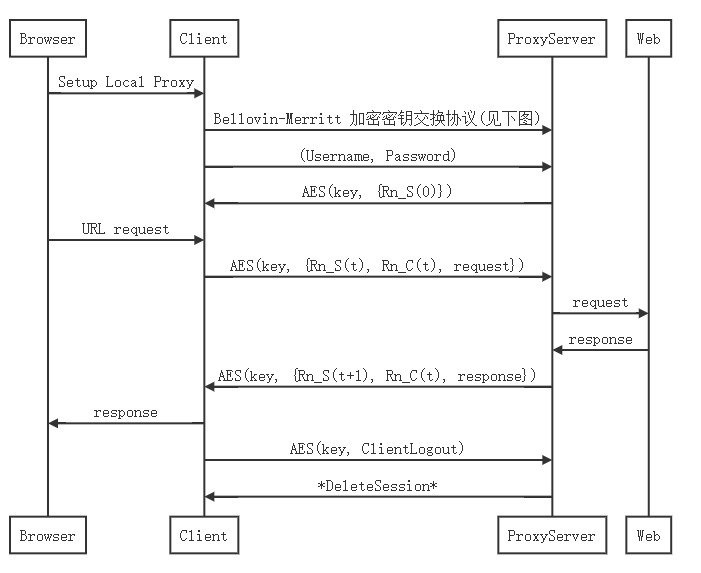
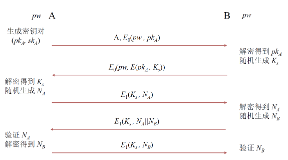
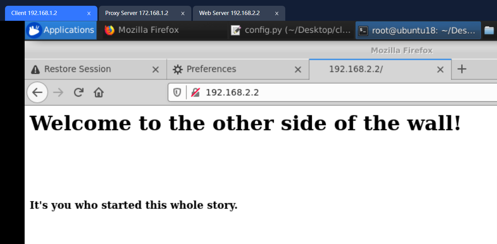
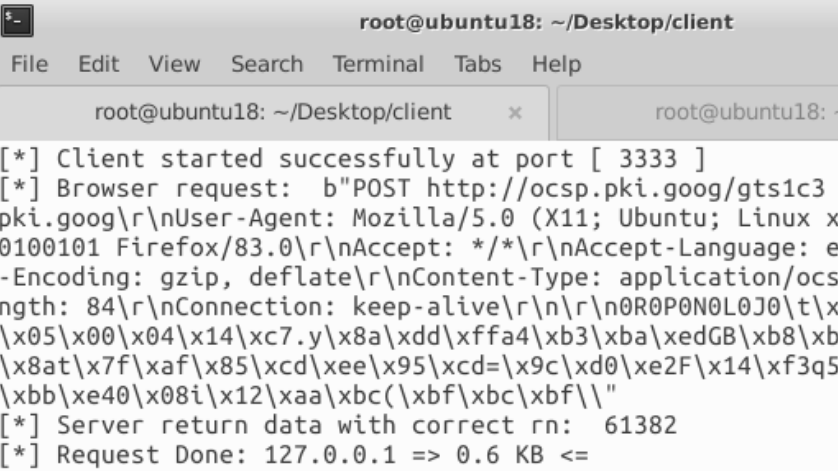
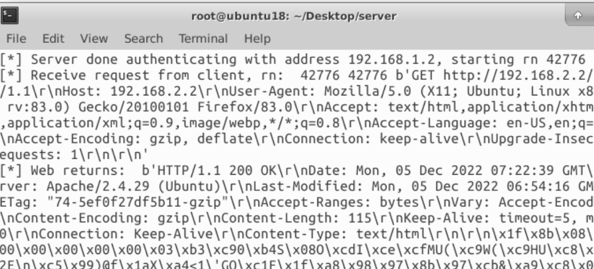

#### APProxy

[toc]

##### 项目结构

```
client:
	client.py				客户端主脚本
	communication.py    	两个通过sock传输字典的帮助函数
	config.py				配置文件
	crypto.py				加密算法函数
	security.py				登录、注销、请求加/解密函数
	install_requirements.sh	安装pip3和rsa库
server:
	server.py
	db_demo.py				一个字典充当用户数据库
	security.py				请求加/解密函数
	(其余文件同client)
webserver:
	statics				静态资源文件夹
	index.html			一个简单的html网页
	run_web_server.sh	启动网页服务的脚本
README.md
assets
```

##### 运行方式

1. 将client, server, webserver文件夹分别打包上传到各自虚拟机中

2. webserver:

    ```bash
    chmod +x ./run_web_server.sh
    ./run_web_server.sh
    ```

3. server/client:

    ```bash
    chmod +x ./install_requirements.sh
    ./install_requirements.sh
    # Server:
    python3 server.py
    # Client:
    python3 client.py
    ```

4. 在Client的Firefox浏览器中修改http代理为127.0.0.1，端口3333

5. 访问192.168.2.2

##### 协议说明

大致思路：客户端和服务端通过Bellovin-Merritt协议协议交换对称密钥，同时服务端给一个随机数，每次客户端发送请求时需要捎带该随机数，随后服务器更新该随机数。

1. AES(key, content)表示用AES算法给content加密，密钥为key

2. Rn表示随机数，Rn_S(t)表示服务端生成的第t个随机数

``` sequence
Browser->Client: Setup Local Proxy
Client->ProxyServer: Bellovin-Merritt 加密密钥交换协议(见下图)
Client->ProxyServer: (Username, Password)
ProxyServer->Client: AES(key, {Rn_S(0)})

Browser->Client: URL request
Client->ProxyServer: AES(key, {Rn_S(t), Rn_C(t), request})
ProxyServer->Web: request
Web->ProxyServer: response
ProxyServer->Client: AES(key, {Rn_S(t+1), Rn_C(t), response})
Client->Browser: response

Client->ProxyServer: AES(key, ClientLogout)
ProxyServer->Client: *DeleteSession*
```





##### TODO

1. 客户端中断连接的请求（ClientLogout）还没加密
2. 客户端/服务端脚本被用户中断时的处理
3. 各种可能的错误的处理
4. 代码写得很烂，很多变量名是乱取的，命名规则还不统一orz
5. 协议流程的具体说明

##### 效果图

###### 客户端





###### 服务端


